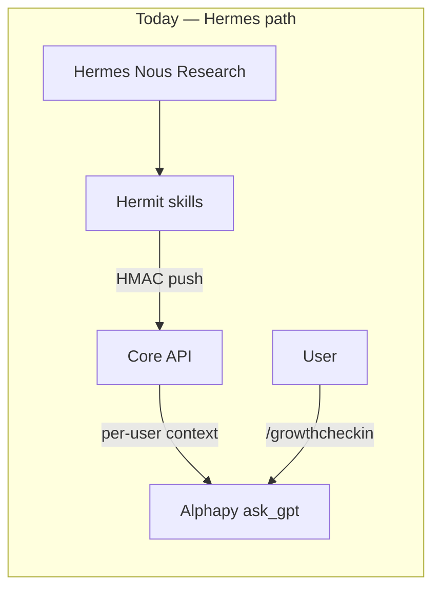

# Alphapy Agents — Architecture & MVP Plan

Multi-user Alphapy agents that run in a **closed loop** inside the Discord bot (and optionally via API), distinct from the personal **Hermes** agent (Nous Research, VPS).

> **Naming:** **Hermes** is the Nous Research personal agent. **Hermit** is the Innersync Python skill host that publishes to Core. Hermes is **not** OpenClaw — unrelated projects.

---

## 1. Current stack analysis + gaps vs Hermes

### What exists today

| Layer | Component | Role |
|-------|-----------|------|
| Personal agent | **Hermes** (Nous Research, VPS) | Long-horizon strategy, Discord DMs, owner-only |
| Publisher | **Hermit** (`Hermit/`) | Skill host → pushes strategic context to Core |
| Broker | **Core API** (`hermit_integrations.py`) | Per-user `hermit_strategic_context`, `hermit_events` |
| Executor | **Alphapy** (`gpt/helpers.py`) | Stateless Grok calls; injects Hermit context + reflections |
| Identity | `alphapy_discord_links` + `/link` | Discord snowflake ↔ Innersync `sub` |
| Encrypted data | App (`EncryptionProvider`) | Zero-knowledge journals; plaintext only after opt-in share |



### Gaps for real multi-user agents

| Gap | Hermes/Hermit today | Needed for Alphapy agents |
|-----|---------------------|---------------------------|
| Runtime | Single-owner VPS cron | Per-user sessions in bot process |
| Trigger | External Hermes (Nous) | `/agent start`, webhooks, scheduled jobs |
| Memory | Core strategic snapshot (TTL) | Durable per-user agent memory + session log |
| Skills | Platform telemetry blocks | User journals, streaks, trades, fatigue, inner voice |
| Closed loop | Events → Hermit re-push | Session complete → memory patch → Hermit event |
| Encryption | Strategic context plaintext | Respect opt-in boundary; never decrypt App ciphertext |
| Scale | One `HERMIT_DEFAULT_USER_ID` | Premium quotas, per-guild toggle, rate limits |

**Reuse (do not rebuild):** Hermit skill protocol, Core event bus, `ask_gpt`, `load_user_reflections`, `get_innersync_id_for_discord`, webhook HMAC, premium GPT quota, `emit_hermit_event`.

---

## 2. Architecture proposal

### Recommendation: lightweight agent runtime **inside Alphapy**, bridge Hermes via Core

Do **not** run a separate Hermes/Nous instance per user. Run a **thin runtime** in Alphapy that mirrors Hermit's skill registry pattern:

```
Discord /agent start reflection
        │
        ▼
agents/runtime.py  ──► resolve agent + skills
        │                  │
        │                  └── journal_sync (reflections, streaks)
        ▼
agents/memory.py   ──► load/patch per-user memory (Supabase)
        ▼
ask_gpt()          ──► synthesize response (existing quota + Grok)
        ▼
complete_session + emit_hermit_event("gpt_command")
        │
        ▼
Hermit daily job (optional) reads events → re-pushes strategic context for power users
```

**Hermes stays** the strategic layer for founders/power users. **Alphapy agents** are the productized, multi-tenant executor loop for all linked users.

Future API path (shipped — same runtime as Discord `/agent`):

```
POST /api/agents/sessions              → start (201)
GET  /api/agents/sessions/active         → active session + message history
POST /api/agents/sessions/{id}/turns     → continue
POST /api/agents/sessions/{id}/complete  → end + Hermit event
```

Registered in `agents/http_routes.py`. Requires Supabase JWT + `/link` (Discord snowflake). See [API Reference](../api/#agent-sessions).

### Module layout (starter code)

```
alphapy/agents/
  base.py          AgentContext, AgentSkill protocol
  registry.py      Agent definitions + skill wiring
  memory.py        Supabase sessions + memory (in-memory fallback)
  pattern_loader.py  Tier-2 pattern context from agent_graph_nodes (learn_from_patterns)
  runtime.py       Closed-loop orchestration
  skills/
    journal_sync.py
    trade_insight.py   # dormant — not registered until product decision
cogs/agents.py     /agent list|start|continue|end|status
```

---

## 3. Bot registration — modular `/agent` commands

| Command | Behavior |
|---------|----------|
| `/agent list` | Lists registered agents (`reflection`) |
| `/agent start [message]` | First turn; session stays `active` |
| `/agent continue <message>` | Append a turn using session message history |
| `/agent end` | Distill Tier 2, patch Tier 3, complete session, delete ephemeral messages |
| `/agent status` | Active session start time + turn count |

**Gates:**

- Global: `ALPHAPY_AGENTS_ENABLED=true`
- Per guild: `/config agents toggle true` (SettingsService, default `false`)
- User: `/link` required (`get_innersync_id_for_discord`)
- Quota: `/agent start` only — `check_and_increment_agent_session_quota()` + Railway `agent_session_usage` (not `gpt_usage`)

**Adding a new agent:**

1. Implement skill(s) under `agents/skills/`
2. Register in `agents/registry.py` `_SKILL_INSTANCES` + `_AGENT_DEFINITIONS`
3. Add `app_commands.Choice` in `cogs/agents.py` if exposed in slash UI

**Adding a new skill to an agent:** update `skills` tuple in `_AGENT_DEFINITIONS` only.

---

## 4. Example code (implemented)

See starter implementation:

- `agents/base.py` — `AgentSkill` protocol, `AgentContext`, `BaseAgent`
- `agents/skills/inner_voice.py` — optional Tier 1 `inner_voice` pref from App agent settings
- `agents/skills/inner_critic_dialogue.py` — Tier 2 inner-conflict mirror + micro-prompt dialogue
- `agents/skills/avoidance_processor.py` — energy-aware avoidance/seal-off vs process; optional Tier 2 write on end
- `agents/skills/chain_breaker_micro.py` — generational chain-break framing + one daily micro-habit
- `agents/skills/journal_sync.py` — reflections via `load_user_reflections`, engagement streak
- `agents/skills/trade_insight.py` — dormant (not exposed in `/agent`)
- `agents/runtime.py` — gather → prompt → `ask_gpt` → memory patch → `complete_session`

Enable locally:

```bash
ALPHAPY_AGENTS_ENABLED=true
ALPHAPY_AGENTS_MEMORY_BACKEND=memory   # no Supabase migration needed
# Per guild: /config agents toggle true
```

---

## 5. Supabase schema (sessions + memory)

Migration: `Innersync_Core/supabase/0020_agent_sessions_memory.sql` (+ `0023_agent_session_messages.sql` for multi-turn)

### Session model (Phase 2.3)

1. `/agent start` → `create_session` (status `active`) → first LLM turn → rows in `agent_session_messages`
2. `/agent continue` → load message history → LLM → append turn
3. `/agent end` → Tier 2 distill (if consented) → `patch_user_memory` (Tier 3) → `complete_session` → delete `agent_session_messages`
4. `emit_hermit_event(gpt_command)` fires on **end**, not on start

`run_agent_session(finalize=True)` remains for tests — start + end in one call.

### Pattern learning (agent graph)

When `agent_prefs.learn_from_patterns` is enabled (App Settings; falls back to `learn_from_shared`), `agents/pattern_loader.py` fetches up to five `agent_graph_nodes` rows (`node_type=pattern`) and injects a `[learned_patterns]` block into the runtime prompt. Tier-2-safe summaries only — no encrypted journal text.

### `agent_sessions`

| Column | Type | Notes |
|--------|------|-------|
| `id` | uuid PK | Session id |
| `innersync_user_id` | uuid | Canonical user key |
| `discord_user_id` | text | Snowflake for ops/debug |
| `guild_id` | text nullable | Multi-guild scope |
| `agent_name` | text | e.g. `reflection` |
| `status` | text | `active`, `completed`, `failed` |
| `summary` | text nullable | Tier-2-conform distilled labels only (not raw LLM text) |
| `memory_patch` | jsonb | Delta applied this session; includes optional `session_insight_snapshot` (insight id/type/label chips for App timeline) |
| `metadata` | jsonb | Source, skill flags |
| `started_at` / `completed_at` / `updated_at` | timestamptz | Audit |

### `agent_memory`

| Column | Type | Notes |
|--------|------|-------|
| `innersync_user_id` + `agent_name` | unique | One blob per user per agent |
| `memory` | jsonb | Tier 1 prefs (via App), Tier 2 `derived_profile`, Tier 3 operational metadata |
| `updated_at` | timestamptz | |

### `agent_session_messages` (Core `0023`)

Ephemeral multi-turn working memory. Rows cascade-delete when the parent session ends.

| Column | Type | Notes |
|--------|------|-------|
| `session_id` | uuid FK | References `agent_sessions.id` |
| `turn_index` | int | 0-based turn number |
| `role` | text | `user` or `assistant` |
| `content` | text | Prompt/response for that turn |
| `created_at` | timestamptz | |

**RLS:** Service role only (same pattern as `agent_sessions`).

---

## 6. Security & rate limiting

| Concern | Mitigation |
|---------|------------|
| Identity | Require `/link`; key all rows by `innersync_user_id` |
| Encrypted journals | Only `load_user_reflections` / opt-in plaintext paths — never decrypt in bot |
| Prompt injection | `safe_prompt` on skill blocks; mark external context as untrusted (same as Hermit) |
| GPT abuse | Existing `check_and_increment_gpt_quota` inside `ask_gpt` |
| Agent session abuse | `check_and_increment_agent_session_quota` on `/agent start` (free: 10/day, monthly: 25/day) |
| Guild blast radius | `agents.enabled` off by default per guild |
| API (future) | `verify_api_key` + Core JWT user resolution; per-user rate limit table |
| Premium | Higher GPT limits via existing tiers; optional `agents.premium_only` setting later |
| PII retention | Session `summary` capped at 4k chars; GDPR purge via `purge_agent_user_data()` on Supabase user delete and `/delete_my_data` |
| Transport | HTTPS + service role; no client-side Supabase keys in bot |

**Rate limit (shipped):** `agent_session_usage` table (Railway migration 024): free 10 starts/user/day, monthly 25, yearly/lifetime unlimited.

---

## 7. MVP next steps (1–2 sprints)

### Sprint 1 — Closed loop live (shipped v3.9.0)

- [x] Agent runtime + skills + `/agent` cog
- [x] Supabase migration `0020` (merged in Core)
- [x] `ALPHAPY_AGENTS_ENABLED` on test bot; `agents.enabled` on test guild
- [x] Unit tests (`tests/test_agents_runtime.py`, `tests/test_agents_policy.py`)
- [x] Document env vars in `docs/configuration.md` and `docs/commands.md`
- [x] Manual jailbreak Matrix A1–A7 on Innersync Dev

### Sprint 2 — Productize

- [x] `journal_sync` skill (reflections opt-in + streaks)
- [x] `inner_voice` skill — Tier 1 `agent_prefs.inner_voice` (App Settings)
- [x] `inner_critic_dialogue`, `avoidance_processor`, `chain_breaker_micro` — Tier 2 dialogue skills + session insight snapshot
- [x] `fatigue_check` skill — energy self-report in App + Discord quick check on `/agent start`
- [x] `POST /api/agents/sessions` (+ turns/complete) in `agents/http_routes.py` (Mind/App trigger)
- [ ] Hermit job: iterate linked users with recent `gpt_command` events → batch context refresh
- [x] Premium tier caps on `/agent start` (free 10/day, monthly 25/day, yearly/lifetime unlimited)
- [x] Rate limits — `agent_session_usage` (migration 024), `check_and_increment_agent_session_quota()`
- [x] GDPR — `purge_agent_user_data()` on user delete webhook + `/delete_my_data`
- [x] Observability: agent session metrics in telemetry ingest (`notes`) and structured `agent_sessions` on `/api/dashboard/metrics` (Mind Telemetry strip)

### Explicit non-goals (MVP)

- No per-user Hermes (Nous Research) deployment
- No decryption of App ciphertext — enforced in `agents/policy.py`; see `docs/agents-safety-guidelines.md`
- No guild-admin visibility into agent outputs (ephemeral by default)

### Safety & compliance

- [x] `agents/policy.py` — canonical `AGENT_SAFETY_RULES` system prompt
- [x] `docs/agents-safety-guidelines.md` — jailbreak test matrix
- [x] `tests/test_agents_policy.py` — policy marker + assembly tests
- [x] Manual jailbreak pass on test bot (Matrix A1–A7, Innersync Dev, 30 jun 2026)

---

## Hermes vs Alphapy agents (decision record)

| | Hermes | Alphapy agents |
|---|--------|----------------|
| Users | Owner / strategic | All linked users |
| Host | VPS (Nous Research) | Alphapy Railway |
| Memory | Core strategic context | `agent_memory` + sessions |
| Skills | Platform telemetry | User growth + trading |
| Trigger | Conversation / cron | `/agent`, API, cron |

## Related docs

- **Product roadmap (META):** `Innersync-meta/ROADMAP-ALPHAPY-AGENTS.md` — naming, multi-turn sessions, open steps, feature phases

**Bridge:** `emit_hermit_event` keeps the existing Hermit closed loop informed without coupling runtimes.
