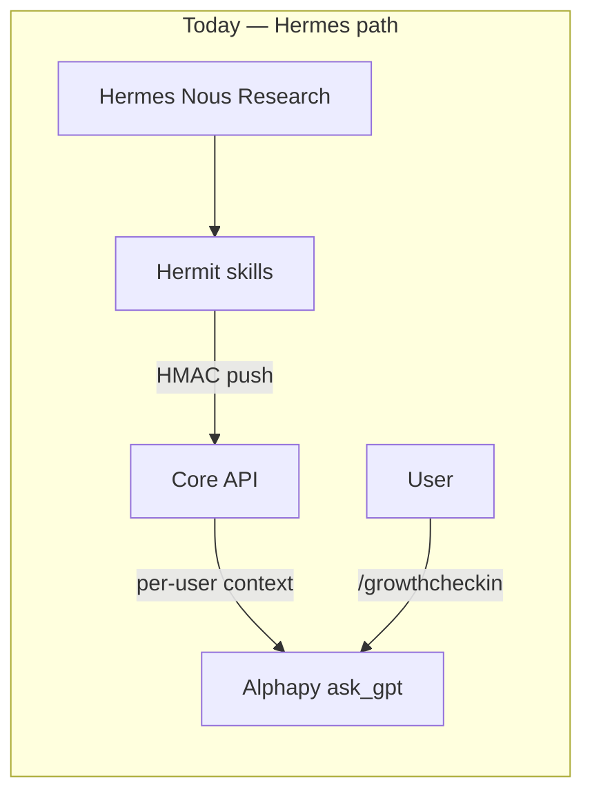

# Alphapy Agents — Architecture & MVP Plan

Multi-user Alphapy agents that run in a **closed loop** inside the Discord bot (and optionally via API), distinct from the personal **Hermes** agent (Nous Research, VPS).

> **Naming:** **Hermes** is the Nous Research personal agent. **Hermit** is the Innersync Python skill host that publishes to Core. Hermes is **not** OpenClaw — unrelated projects.

---

## 1. Current stack analysis + gaps vs Hermes

### What exists today

| Layer | Component | Role |
|-------|-----------|------|
| Personal agent | **Hermes** (Nous Research, VPS) | Long-horizon strategy, Discord DMs, owner-only |
| Publisher | **Hermit** (`Hermit/`) | Skill host → pushes strategic context to Core |
| Broker | **Core API** (`hermit_integrations.py`) | Per-user `hermit_strategic_context`, `hermit_events` |
| Executor | **Alphapy** (`gpt/helpers.py`) | Stateless Grok calls; injects Hermit context + reflections |
| Identity | `alphapy_discord_links` + `/link` | Discord snowflake ↔ Innersync `sub` |
| Encrypted data | App (`EncryptionProvider`) | Zero-knowledge journals; plaintext only after opt-in share |



### Gaps for real multi-user agents

| Gap | Hermes/Hermit today | Needed for Alphapy agents |
|-----|---------------------|---------------------------|
| Runtime | Single-owner VPS cron | Per-user sessions in bot process |
| Trigger | External Hermes (Nous) | `/agent start`, webhooks, scheduled jobs |
| Memory | Core strategic snapshot (TTL) | Durable per-user agent memory + session log |
| Skills | Platform telemetry blocks | User journals, streaks, trades, fatigue, inner voice |
| Closed loop | Events → Hermit re-push | Session complete → memory patch → Hermit event |
| Encryption | Strategic context plaintext | Respect opt-in boundary; never decrypt App ciphertext |
| Scale | One `HERMIT_DEFAULT_USER_ID` | Premium quotas, per-guild toggle, rate limits |

**Reuse (do not rebuild):** Hermit skill protocol, Core event bus, `ask_gpt`, `load_user_reflections`, `get_innersync_id_for_discord`, webhook HMAC, premium GPT quota, `emit_hermit_event`.

---

## 2. Architecture proposal

### Recommendation: lightweight agent runtime **inside Alphapy**, bridge Hermes via Core

Do **not** run a separate Hermes/Nous instance per user. Run a **thin runtime** in Alphapy that mirrors Hermit's skill registry pattern:

```
Discord /agent start reflection
        │
        ▼
agents/runtime.py  ──► resolve agent + skills
        │                  │
        │                  └── journal_sync (reflections, streaks)
        ▼
agents/memory.py   ──► load/patch per-user memory (Supabase)
        ▼
ask_gpt()          ──► synthesize response (existing quota + Grok)
        ▼
complete_session + emit_hermit_event("gpt_command")
        │
        ▼
Hermit daily job (optional) reads events → re-pushes strategic context for power users
```

**Hermes stays** the strategic layer for founders/power users. **Alphapy agents** are the productized, multi-tenant executor loop for all linked users.

Future API path (same runtime):

```
POST /api/agents/{agent}/run  (API key + user JWT via Core)
        │
        └── run_agent_session(...)  # shared with Discord cog
```

### Module layout (starter code)

```
alphapy/agents/
  base.py          AgentContext, AgentSkill protocol
  registry.py      Agent definitions + skill wiring
  memory.py        Supabase sessions + memory (in-memory fallback)
  runtime.py       Closed-loop orchestration
  skills/
    journal_sync.py
    trade_insight.py   # dormant — not registered until product decision
cogs/agents.py     /agent list|start|status
```

---

## 3. Bot registration — modular `/agent` commands

| Command | Behavior |
|---------|----------|
| `/agent list` | Lists registered agents (`reflection`) |
| `/agent start [message]` | Runs reflection closed loop; ephemeral response |
| `/agent status` | Shows active reflection session if any |

**Gates:**

- Global: `ALPHAPY_AGENTS_ENABLED=true`
- Per guild: `/config agents toggle true` (SettingsService, default `false`)
- User: `/link` required (`get_innersync_id_for_discord`)
- Quota: `ask_gpt` daily limit (existing `gpt_usage`)

**Adding a new agent:**

1. Implement skill(s) under `agents/skills/`
2. Register in `agents/registry.py` `_SKILL_INSTANCES` + `_AGENT_DEFINITIONS`
3. Add `app_commands.Choice` in `cogs/agents.py` if exposed in slash UI

**Adding a new skill to an agent:** update `skills` tuple in `_AGENT_DEFINITIONS` only.

---

## 4. Example code (implemented)

See starter implementation:

- `agents/base.py` — `AgentSkill` protocol, `AgentContext`, `BaseAgent`
- `agents/skills/journal_sync.py` — reflections via `load_user_reflections`, engagement streak
- `agents/skills/trade_insight.py` — dormant (not exposed in `/agent`)
- `agents/runtime.py` — gather → prompt → `ask_gpt` → memory patch → `complete_session`

Enable locally:

```bash
ALPHAPY_AGENTS_ENABLED=true
ALPHAPY_AGENTS_MEMORY_BACKEND=memory   # no Supabase migration needed
# Per guild: /config agents toggle true
```

---

## 5. Supabase schema (sessions + memory)

Migration: `Innersync_Core/supabase/0020_agent_sessions_memory.sql`

### `agent_sessions`

| Column | Type | Notes |
|--------|------|-------|
| `id` | uuid PK | Session id |
| `innersync_user_id` | uuid | Canonical user key |
| `discord_user_id` | text | Snowflake for ops/debug |
| `guild_id` | text nullable | Multi-guild scope |
| `agent_name` | text | e.g. `reflection` |
| `status` | text | `active`, `completed`, `failed` |
| `summary` | text nullable | LLM output preview |
| `memory_patch` | jsonb | Delta applied this session |
| `metadata` | jsonb | Source, skill flags |
| `started_at` / `completed_at` / `updated_at` | timestamptz | Audit |

### `agent_memory`

| Column | Type | Notes |
|--------|------|-------|
| `innersync_user_id` + `agent_name` | unique | One blob per user per agent |
| `memory` | jsonb | Durable facts, last themes, preferences |
| `updated_at` | timestamptz | |

**RLS:** Same deny-by-default pattern as `hermit_*` tables — service role only; Alphapy uses `SUPABASE_SERVICE_ROLE_KEY`.

---

## 6. Security & rate limiting

| Concern | Mitigation |
|---------|------------|
| Identity | Require `/link`; key all rows by `innersync_user_id` |
| Encrypted journals | Only `load_user_reflections` / opt-in plaintext paths — never decrypt in bot |
| Prompt injection | `safe_prompt` on skill blocks; mark external context as untrusted (same as Hermit) |
| GPT abuse | Existing `check_and_increment_gpt_quota` inside `ask_gpt` |
| Guild blast radius | `agents.enabled` off by default per guild |
| API (future) | `verify_api_key` + Core JWT user resolution; per-user rate limit table |
| Premium | Higher GPT limits via existing tiers; optional `agents.premium_only` setting later |
| PII retention | Session `summary` capped at 4k chars; GDPR purge hook on user delete (extend `webhooks/supabase.py`) |
| Transport | HTTPS + service role; no client-side Supabase keys in bot |

**Rate limit sketch (post-MVP):** `agent_invocations` table or Redis counter: `max 10 sessions/user/day` on free tier.

---

## 7. MVP next steps (1–2 sprints)

### Sprint 1 — Closed loop live (this PR)

- [x] Agent runtime + 2 skills + `/agent` cog
- [x] Supabase migration draft
- [ ] Apply migration on staging Supabase
- [ ] Enable `ALPHAPY_AGENTS_ENABLED` on staging; flip `agents.enabled` on test guild
- [ ] Unit tests green (`tests/test_agents_runtime.py`)
- [ ] Document env vars in `docs/configuration.md`

### Sprint 2 — Productize

- [ ] `fatigue_check` skill (sleep/activity signals from App or self-report modal)
- [ ] `inner_voice` skill (short prompts from `profiles` prefs)
- [ ] `POST /api/agents/run` on `api.py` (Mind/App trigger)
- [ ] Hermit job: iterate linked users with recent `gpt_command` events → batch context refresh
- [ ] Premium-only agents or higher limits for `yearly`/`lifetime`
- [ ] GDPR: purge `agent_sessions` / `agent_memory` on user delete webhook
- [ ] Observability: agent session metrics in telemetry ingest

### Explicit non-goals (MVP)

- No per-user Hermes (Nous Research) deployment
- No decryption of App ciphertext
- No guild-admin visibility into agent outputs (ephemeral by default)

---

## Hermes vs Alphapy agents (decision record)

| | Hermes | Alphapy agents |
|---|--------|----------------|
| Users | Owner / strategic | All linked users |
| Host | VPS (Nous Research) | Alphapy Railway |
| Memory | Core strategic context | `agent_memory` + sessions |
| Skills | Platform telemetry | User growth + trading |
| Trigger | Conversation / cron | `/agent`, API, cron |

**Bridge:** `emit_hermit_event` keeps the existing Hermit closed loop informed without coupling runtimes.
